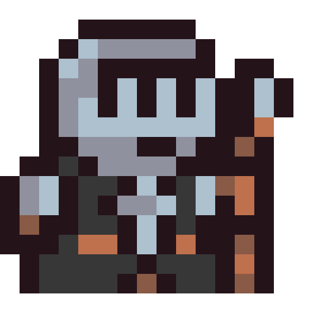

# SwordStone 🗡️🪨
<p align="center">
  
</p>

SwordStone is a retro 2D pixel art game developed in C++ using the SFML library. The player takes on the role of a knight in a dungeon filled with enemies, treasures, and challenges, while utilizing object-oriented programming concepts to implement animations, collisions, and other interactive game elements.

## Presentation and Motivation 🎮

The choice of the SwordStone project was driven by the desire to explore and deepen object-oriented programming concepts in a practical and engaging context. By developing this 2D game, I aimed to implement fundamental principles of OOP, such as encapsulation and inheritance, to create a dynamic and lively gaming experience.

Implementing a retro-style game in pixel art brought interesting opportunities for design and development, and using the SFML library provided a friendly and robust environment for managing graphics, sounds, and player interactions. Through this project, my goal was to learn and apply good programming practices, code structuring, and resource management in a complex development environment.

Throughout the documentation, I will explore in detail how I used object-oriented programming concepts to implement the game's functionalities. I will describe animation and collision elements, as well as various tools and techniques used to facilitate the creation of this captivating game. By documenting and explaining the development process, I aim to provide readers with a clear understanding of how OOP can be applied in a real-world context and inspire them to explore the potential of this paradigm in their own projects.

In the following sections, I will delve into implementation details and provide practical examples to highlight the advantages and importance of object-oriented programming in game development.

## Installation ⚙️

To run SwordStone on your local machine, follow these steps:

1. Clone the repository:

   ```
   git clone https://github.com/Yirade/SwordStone.git
   ```

2. Navigate to the project directory:

   ```
   cd SwordStone
   ```

3. Compile the source code using a C++ compiler:

   ```
   cmake .
   make
   ```

4. Run the game:

   ```
   ./bin/game
   ```
   
## Features ✨

- Retro pixel art graphics and animations 🎮
- Intuitive and responsive controls 🕹️
- Dynamic collision detection ⚔️
- Engaging effects and background music 🔊
- Interactive environment with treasures and obstacles 🌟

## Documentation 📖

The detailed documentation of SwordStone can be found in the [Docs](SwordStone - Documentatie.pdf) directory. It covers the following topics:

1. Game architecture and class hierarchy 🏰
2. Animation implementation using spritesheets 🎥
3. Collision detection and response mechanisms ⚔️
4. Sound management and effects integration 🔊
5. Player input handling and character movement 🎮

## Contributing 🤝

Contributions to SwordStone are welcome! If you encounter any issues or have suggestions for improvements, please open an issue on the [issue tracker](https://github.com/Yirade/SwordStone/issues). If you'd like to contribute code, please follow the guidelines in the [CONTRIBUTING.md](CONTRIBUTING.md) file.

## License 📄

SwordStone is released under the [MIT License](LICENSE).

Certainly! Here's the updated Acknowledgements section with icons added:

## Acknowledgements 🙏

I would like to express my gratitude to the following individuals and organizations for their contributions to SwordStone:

- [0x72](https://0x72.itch.io/): 🎨 For providing the amazing pixel art graphics that bring the game to life.
- [Pixel Poem](https://pixel-poem.itch.io/): 🎨 For their fantastic pixel art assets used in creating the game's visual style.
- [XdeviRuchi](https://soundcloud.com/xdeviruchi): 🎵 For the captivating soundtrack that enhances the gaming experience and immerses players in the world of SwordStone.

I would also like to extend my thanks to the creators and contributors of the SFML library for providing such a powerful and user-friendly tool for game development. Additionally, I want to express my appreciation to the online communities and forums where I found inspiration, guidance, and valuable insights during the development of this project.

## Contact 📧

For any inquiries or questions regarding SwordStone, please contact me at contact@yirade.dev.

**

Thank you for your interest in SwordStone! Enjoy the game! 🎉**
